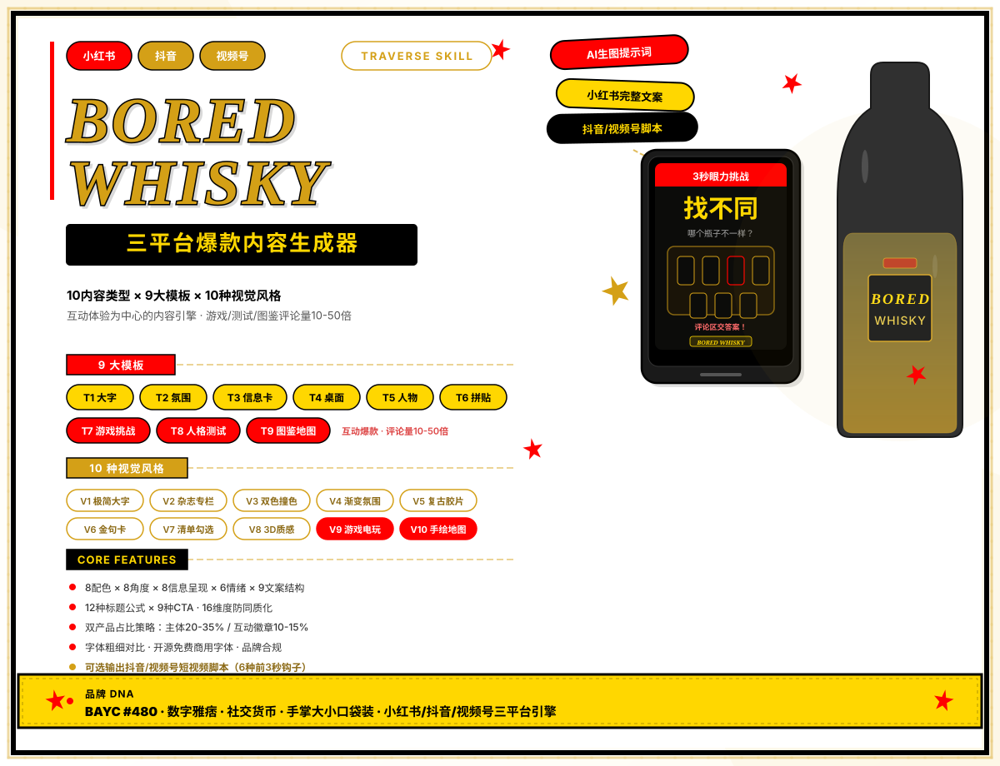
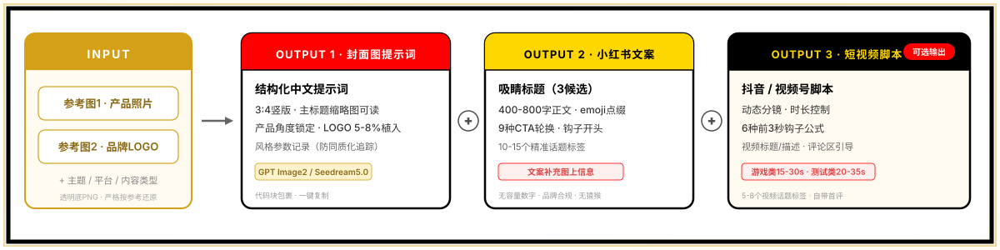
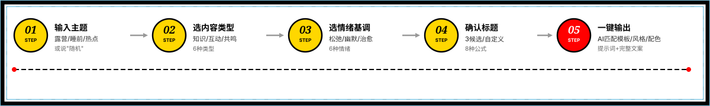

<!-- Generated by Trae Work -->
<p align="center">
  
</p>

<div align="center">

<p>
  <strong>BORED WHISKY 品牌专属 · 三平台爆款内容引擎</strong>
</p>

<p>
  
  
  
  
  
  
</p>

</div>

**一张图，三个平台，一次搞定。**

BORED WHISKY 专属的AI内容生成Skill，为威士忌品牌社交媒体运营量身打造。输入主题或让AI推荐，即可一键生成高端封面静图提示词 + 小红书图文包 + 抖音/视频号静图视频包（含AI音乐指引）。融合设计美学与平台传播逻辑，让品牌内容从"产品展示"升级为"互动体验"。

**核心思路**：让用户先玩起来、先共鸣、先收藏，品牌自然被记住。游戏挑战、人格测试、知识图鉴三类高互动内容，经真实数据验证可带来数倍至数十倍的互动提升。

---

**目录**

- [能做什么](#能做什么)
- [一图三平台](#一图三平台)
- [三大爆款引擎](#三大爆款引擎)
- [快速开始](#快速开始)
- [工作流程](#工作流程)
- [内容能力](#内容能力)
- [AI音乐](#ai音乐)
- [安装说明](#安装说明)
- [注意事项](#注意事项)
- [项目结构](#项目结构)
- [License](#license)

---

## 能做什么

为 BORED WHISKY 品牌日常社交媒体运营提供全链路内容支持：

- **小红书图文笔记**：从封面图到标题、正文、标签、发布时间建议，完整输出
- **抖音静图视频**：一张高端静图 + AI背景音乐，适配抖音传播逻辑
- **视频号静图视频**：适合社交裂变的静图视频内容，匹配30-50岁用户审美
- **AI生图提示词**：可直接复制到 GPT Image2 / Seedream / Nano Banana 等工具出图
- **AI音乐指引**：根据内容情绪智能推荐纯音乐或有歌词音乐，给出完整生成提示
- **持续内容日历**：内置月度热点/节日/节气日历，AI可自动推荐当日最佳主题

支持从冷启动到成熟期的全阶段内容策略配比，覆盖知识科普、情绪共鸣、互动投票、游戏挑战、人格测试、热点节日、系列连载等全场景。

---

## 一图三平台

<p align="center">
  
</p>

一次生成，三个平台各取所需：

**一张核心静图（3:4竖版高端封面）**：
- 所有平台共用同一张精心设计的核心视觉
- 主标题在缩略图下0.5秒可读，OCR搜索友好
- 核心元素居中布局，自动适配9:16竖版视频
- 代码块包裹提示词，一键复制到AI生图工具

**小红书图文包**：标题 + 正文 + 标签 + 互动引导 + 发布建议
**抖音静图视频包**：视频标题 + 描述 + 标签 + 收藏引导 + AI音乐指引 + 封面建议
**视频号静图视频包**：视频标题 + 描述 + 标签 + 转发引导 + AI音乐指引 + 社交分发建议

> 视频形式均为"静图+AI背景音乐"，无需拍摄、无需口播、无需剪辑，音乐是唯一动态元素。

---

## 三大爆款引擎

区别于传统的"产品图+文案"模式，内置三类经真实数据验证的高互动内容引擎：

<details>
<summary><strong>🎮 游戏挑战型</strong> — 让用户停下来"做题"</summary>

通过出题→思考→评论交答案的互动闭环，强迫用户停留、思考、打字。猜谜、找不同、造句挑战、截屏测试、色感挑战、观察力测试……游戏视觉占据画面主体，产品以品牌徽章形式自然出现，评论量可达普通内容的数十倍。

- 题目有明确答案，不模棱两可
- 游戏区占画面一半以上，视觉清晰可玩
- 文案短平快，直接上题不铺垫
- 强引导评论交作业

</details>

<details>
<summary><strong>🧠 人格测试型</strong> — 让用户主动@好友</summary>

利用"自我标签+分享欲"心理，用户看到选项会忍不住对号入座，然后@好友"快来测测你是哪种"。微醺人格测试、饮酒人格揭秘、直觉选图测试……点击率和分享率显著高于普通内容。

- 人格描述有趣正面，让人想认领
- 2-4个选项，每个选项有独特视觉区分
- 引导@好友一起来测
- 产品作为品牌徽章自然植入

</details>

<details>
<summary><strong>🗺️ 图鉴地图型</strong> — 让用户忍不住截图保存</summary>

可视化知识呈现，风味轮、术语地图、下酒菜图鉴、产区地图、调酒配方图谱……信息密度高、结构清晰、视觉精美，用户看到第一反应是"存下来以后用"，收藏率远高于普通清单内容。

- 真正的可视化呈现（分支图/分区图/轮状图），不是文字堆砌
- 信息节点精炼，每张图控制在合理信息量
- 整体有"值得截图"的价值感
- 标题自然引导收藏

</details>

---

## 快速开始

**一句话生成：**
```
帮我生成一篇 BORED WHISKY 的周五晚间内容
8月8日推荐一篇
今天做什么好
```

**指定类型：**
```
做一篇游戏挑战型
来一个人格测试
做一张威士忌入门知识图鉴
```

**指定方向：**
```
做一篇T3信息卡风格的知识清单，V2杂志风
用T7游戏挑战卡+V9游戏风，做一个找不同
结合最近热点做一篇
```

AI会逐步引导你确认内容方向，然后自动匹配最佳模板、视觉风格、配色方案和平台策略，最终输出完整可用的内容包。

<p align="center">
  
</p>

---

## 内容能力

<details>
<summary><strong>📐 9大内容模板</strong> — 点击展开</summary>

| 模板 | 适合场景 | 核心特征 |
|------|---------|---------|
| T1 产品特写+大字标题 | 提问、热点、态度宣言 | 超大标题压顶，视觉冲击强 |
| T2 场景氛围+情绪文案 | 职场共鸣、治愈、仪式感 | 产品融入日常场景，氛围感强 |
| T3 信息卡/杂志页 | 知识清单、攻略、连载 | 3-5条完整信息，杂志编辑感 |
| T4 桌面搭配/Flat Lay | 生活方式、调酒、松弛感 | 俯拍美学，精致物件搭配 |
| T5 人物瞬间+故事感 | 体验感、情绪共鸣 | 手部/侧脸特写，代入感强 |
| T6 创意拼贴/潮流设计 | 玩梗、投票、年轻态度 | 拼贴元素错落，设计感强 |
| T7 游戏挑战卡 | 猜谜/找不同/造句/截屏 | 游戏区为主体，强互动 |
| T8 人格测试卡 | MBTI/直觉/饮酒人格 | 选项格均分画面，社交货币 |
| T9 图鉴/信息图 | 风味地图/术语/产区 | 可视化知识，高收藏 |

</details>

<details>
<summary><strong>🎨 10种视觉风格 × 8种配色</strong> — 点击展开</summary>

**视觉风格**：极简大字报 / 杂志专栏 / 双色撞色 / 渐变氛围 / 复古胶片 / 金句卡 / 清单勾选 / 3D质感 / 游戏电玩 / 手绘地图

**配色方案**：经典琥珀 / 薄荷夏日 / 暖棕复古 / 高对比撞色 / 冷调雾霾 / 深夜微醺 / 马卡龙清新 / 莫兰迪高级

结合8种构图角度、8种信息呈现方式、丰富的装饰元素库和材质背景库，组合空间超过8000万种，配合19维防同质化检查机制，确保每日内容持续新鲜不重复。

</details>

<details>
<summary><strong>✍️ 文案与情绪系统</strong> — 点击展开</summary>

- **6种情绪基调**：幽默自嘲 / 真诚松弛 / 干货硬核 / 扎心共鸣 / 热血态度 / 治愈温暖
- **12种经过验证的标题范式**：覆盖提问式、数字干货、身份痛点、反差颠覆、站队投票、热梗嫁接、悬念好奇、金句态度、挑战式、测试式、揭秘式、图鉴式
- **9种文案结构**：从知识清单到游戏挑战，每种内容类型有匹配的叙事节奏
- **Emoji使用规范**：恰到好处的emoji增加趣味，但不过度堆砌
- **智能CTA**：根据平台特性选择最合适的互动引导方式

</details>

---

## AI音乐

静图视频的灵魂是音乐。内置完整的AI音乐指引系统，让静图视频不再是"一张图+随便配个BGM"。

- **10种情绪标签**：松弛/治愈/微醺/酷感/俏皮/怀旧/悬疑/热血/慵懒/浪漫
- **智能匹配纯音乐或有歌词**：知识类内容默认纯音乐不干扰阅读，情绪/互动/节日类可智能搭配有歌词音乐
- **时长自动适配**：根据内容类型和平台特性建议音乐时长（最低30秒，适配主流AI音乐工具）
- **9种推荐曲风**：Lo-fi / Cool Jazz / Bossa Nova / Blues / 轻电子 / 钢琴曲 / 复古唱片感 / Ambient / 轻R&B
- **平台差异化推荐**：抖音偏节奏感和抓耳旋律，视频号偏情感共鸣和温暖怀旧
- **完整生成提示**：直接输出可用于 Suno / Udio 等AI音乐工具的生成提示词

有歌词内容会提供歌词主题、人声风格、语言选择、关键词等完整指引，默认歌词稀疏（大量乐器间奏，人声作为情绪点缀而非主角），不喧宾夺主。

---

## 三平台适配

深度理解三大平台的传播逻辑，同一核心内容做针对性适配：

**小红书**：侧重搜索SEO优化和互动深度，标题和封面OCR文字均可被搜索收录，文案结构适配平台阅读习惯，发布后有完整的互动节奏建议。

**抖音**：侧重收藏价值和音乐抓耳度，理解平台长尾推荐机制，标题和描述适配短平快的信息流场景，给出7天观察期建议。

**视频号**：侧重社交裂变和转发动力，理解社交推荐与算法推荐的双引擎逻辑，音乐选择偏成熟审美，内容更适合朋友圈和群聊转发场景。

所有平台内容共享同一张核心静图，仅在文案策略、音乐选择、互动引导、发布节奏上做差异化处理，一次制作、三端分发。

---

## 安装说明

```bash
git clone https://github.com/ifeihong/bored-whisky-xhs.git
cp -r bored-whisky-xhs/ your-project/.trae/skills/
```

安装后在支持Skill的AI编辑器（如Trae）中即可直接调用。

**使用准备**：
- 需要配合外部AI生图模型（GPT Image2 / Seedream5.0 / Nano Banana Pro 等）
- 使用时准备两张参考图：产品白底图（透明底PNG最佳）+ 品牌LOGO
- AI音乐可使用 Suno / Udio 等工具根据指引生成

---

## 注意事项

- 产品外观严格按照参考图还原，不脑补未展示的细节
- 严禁在画面中额外生成猴子/猿猴类形象（产品瓶身自带LOGO除外）
- 人物画面可使用手部特写、侧脸、剪影等作为钩子，完整正脸需谨慎
- 文案中不出现具体容量数字，用"口袋装""小瓶装""手掌大小"等表达
- 知识型内容保持客观中立，不使用绝对化表述
- 游戏类题目确保有明确唯一答案
- 人格测试描述保持正面有趣，不使用负面标签
- 本Skill为BORED WHISKY品牌定制，品牌规则详见 `brand.md`

---

## 项目结构

Skill采用模块化架构，便于维护和扩展：

```
bored-whisky-xhs/
├── SKILL.md              # 入口文件
├── brand.md              # 品牌知识库
├── templates.md          # 内容模板定义
├── visual-system.md      # 视觉设计系统
├── copywriting.md        # 文案写作规范
├── music-guide.md        # AI音乐指引
├── platform-strategy.md  # 平台适配策略
├── output-spec.md        # 输出格式规范
├── assets/readme/        # 文档插图
└── README.md             # 本文件
```

---

### License

本Skill为BORED WHISKY品牌营销内容生产工具，框架和提示词系统可自由使用和修改。

---

<p align="center">
<small>基于真实平台数据持续迭代优化 · 让好内容自己会传播</small>
</p>
